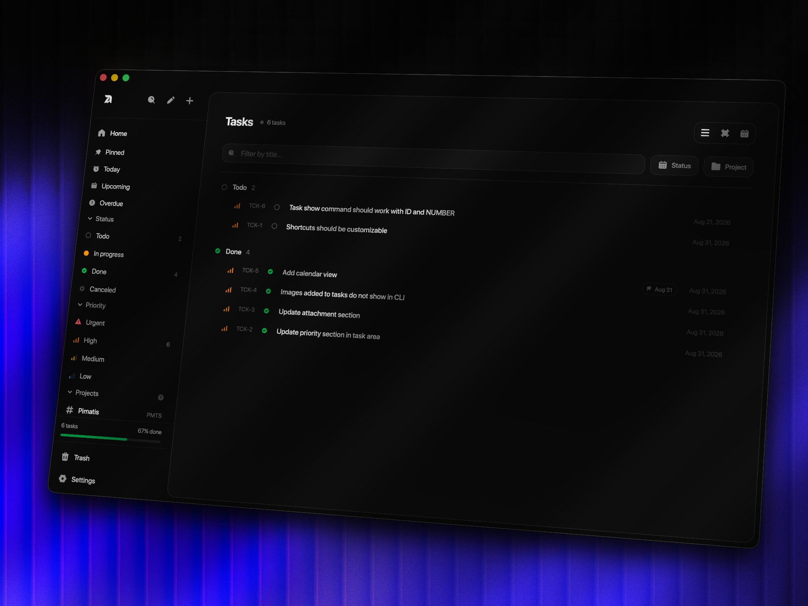

# tack



A desktop task manager for humans and AI agents. No bullshit, no bloat. Just tasks, projects, and a CLI that talks to the same database as the app.

## prerequisites

- [Rust](https://rustup.rs/) (stable)
- [Bun](https://bun.sh/) (latest)

## install

```bash
git clone https://github.com/pimatis/tack.git
cd tack
bun install
```

## develop

```bash
bun run tauri dev
```

## build

```bash
bun run tauri build
```

Output goes to `src-tauri/target/release/`.

## cli

The CLI binary (`tack`) is built alongside the app and installed automatically.

To build it standalone:

```bash
cd src-tauri
cargo build --bin tack
./target/debug/tack --help
```

## license

Apache-2.0, see [LICENSE](LICENSE)
